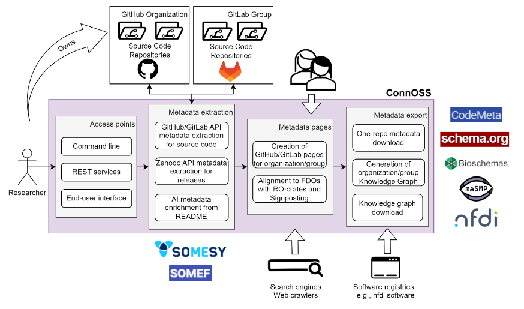

# About

## **Connecting Research Software Through FAIR Metadata**

Research software is a cornerstone of modern science, yet it often remains difficult to discover and reuse. Many software projects lack complete and consistent metadata, making it challenging for others to understand what the software does, how to use it, and how to cite it. Existing metadata schemas—such as CodeMeta, Bioschemas, and maSMP—offer solutions, but their adoption is inconsistent, fragmented, and often limited to specific domains. As a result, researchers struggle to share their work effectively, registries cannot fully catalog software, funding agencies find it hard to assess impact, and the broader scientific community faces barriers to building on existing tools. There is a clear need for an integrated, automated approach that ensures research software is visible, well-described, and easy to reuse, benefiting both creators and the wider research ecosystem.

ConnOSS addresses this need by automatically extracting metadata from GitHub, GitLab, and other repositories, enriching it with artificial intelligence, and publishing it in standard formats. This benefits researchers by creating professional software portfolios automatically, helps registries by providing consistent, high-quality data, and enables the research community to find and reuse existing solutions more effectively. The system builds on existing standards like CodeMeta and Schema.org, working with your current workflow without requiring new tools or additional steps. The result is better visibility and discoverability for research software across the entire ecosystem.

## Objectives

🎯 **Define a metadata schema** that combines and extends existing schemas

🎯 **Provide tools** to extract machine-actionable metadata from existing sources

🎯 **Enrich the metadata** with machine learning approaches

🎯 **Publish the metadata** for both human and machine consumption

## ConnOSS Infrastructure

  
  
ConnOSS infrastructure components showing metadata extraction, enrichment, and publication workflow

The infrastructure includes multiple access points for user interaction, metadata extraction from direct sources and machine learning approaches, publication pages for both humans and machines, and export capabilities for registries and aggregators. The metadata pages align with FAIR Digital Object standards using RO-Crates and FAIR Signposting for full web compatibility.

## Use Cases

ConnOSS supports three main use cases:

💡 **For Researchers**: Providing a harmonized overview of their software production

💡 **For FAIR Compliance**: Exposing machine-actionable metadata aligned to FAIR4RS principles  

💡 **For Registries and Aggregators**: Facilitating metadata consumption and integration

We envision a future where research software is as discoverable and citable as research papers. Where finding the right tool for your research is as easy as finding the right paper. Where software development gets the recognition it deserves in the scientific community. ConnOSS is our contribution to making that vision a reality.

## Reference

Castro, L. J., Mathiak, B., & Nieße, A. (2025). Connected Open Source Software - ConnOSS - Proposal (v1.0.0). [Zenodo](https://doi.org/10.5281/zenodo.15616384)
