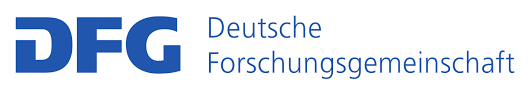

# Home

## ConnOSS (**Conn**ected **O**pen **S**ource **S**oftware)

ConnOSS is a DFG-funded research project that aims to help researchers showcase their software work and makes it easier for others to find and use research software. We believe that good research software should be visible, properly described, and easy to discover.

ConnOSS offers an automated infrastructure that generates consistent, harmonized, and enriched metadata for research software. Unlike manual metadata creation, which is time-consuming, or existing tools with limited coverage, ConnOSS streamlines the process—enabling researchers to enhance the visibility and FAIRness of their software with minimal effort.

ConnOSS is funded by the Deutsche Forschungsgemeinschaft (DFG) under grant number 561044496, as part of the "Research Data and Software" program within the [Scientific Library Services and Information Systems (LIS)](https://www.dfg.de/de/foerderung/foerdermoeglichkeiten/programme/infrastruktur/lis) funding scheme.

  

More information can be found at [DFG's GEPRIS research information system](https://gepris.dfg.de/gepris/projekt/561044496).

  <a href="about/" class="md-button md-button--primary" style="margin: 10px;">Learn More</a>
  <a href="team/" class="md-button md-button--primary" style="margin: 10px;">Meet the Team</a>
  <a href="blog/" class="md-button md-button--primary" style="margin: 10px;">Follow Our Progress</a>

