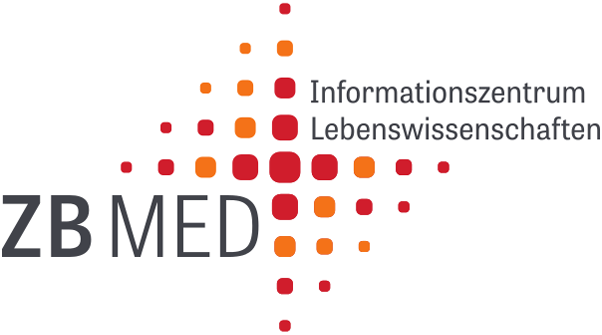
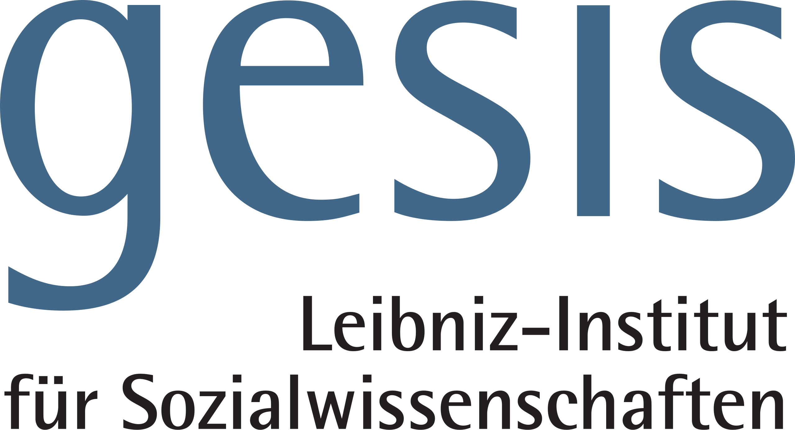
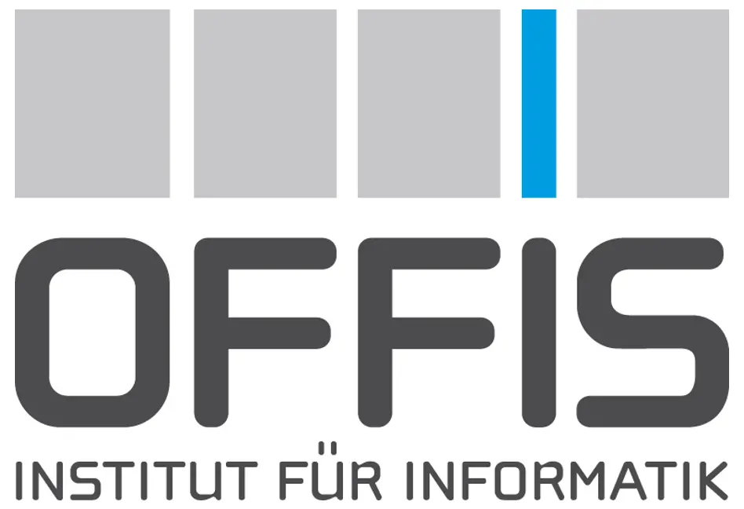

## Project Partners

  
  
<strong>ZB MED</strong> Information Centre for Life Sciences

  
  
<strong>GESIS</strong> Leibniz Institute for the Social Sciences

  
  
<strong>Carl von Ossietzky University</strong> Oldenburg

  
  
<strong>OFFIS</strong> Institute for Information Technology

## Authors

👤 **[Leyla Jael Castro](https://orcid.org/0000-0003-3986-0510)**  
ZB MED - Information Centre for Life Sciences

👤 **[Brigitte Mathiak](https://orcid.org/0000-0003-1793-9615)**  
GESIS - Leibniz-Institut für Sozialwissenschaften  

👤 **[Astrid Nieße](https://orcid.org/0000-0003-1881-9172)**  
Carl von Ossietzky Universität Oldenburg

## Contributors

👤 **[Stephan Ferenz](https://orcid.org/0000-0001-9523-7227)**  
OFFIS - Institute for Information Technology  

👤 **[Lu Gan](https://orcid.org/0000-0001-5844-3021)**  
GESIS - Leibniz-Institut für Sozialwissenschaften 

👤 **[Oliver Werth](https://orcid.org/0000-0002-6767-5905)**  
OFFIS - Institute for Information Technology 

👤 **[Aida Jafarbigloo](https://orcid.org/0000-0002-1435-0584)**  
OFFIS - Institute for Information Technology

👤 **[Suhasini Venkatesh](https://orcid.org/0009-0005-7305-3052)**  
ZB MED - Information Centre for Life Sciences

## Get in Touch

We'd love to hear from you! Whether you're a researcher interested in using ConnOSS, an institution looking to collaborate, or someone with questions about the project, we're here to help.

## Support

For technical support, bug reports, or feature requests, please:

1. Check our [GitHub Issues](https://github.com/connoss-project/connoss-project.github.io/issues)
2. Create a new issue if your problem isn't already reported
3. Contact us directly at [xxx](xxx)

## Collaboration Opportunities

We're always interested in collaborating with:

- **Research Groups** looking to improve their software visibility
- **Software Registries** and aggregators seeking high-quality metadata
- **Developers** interested in contributing to the project
- **Researchers** working on FAIR principles and metadata standards
